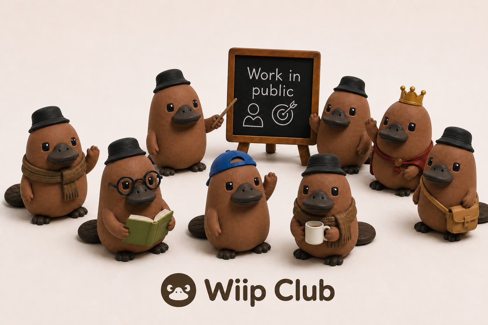

# Wiip Club

<<<<<<< HEAD
[](https://wiip.club)

Comunidade work in public.

Site: [https://wiip.club](https://wiip.club)
=======
Landing da comunidade **work in public**, com o mascote **Wiipo**.

## Capa e perfil

- Capa: `public/wiipo/capa/` (`comece-aqui.jpg`, `work-in-public.jpg`, `hero.jpg`)
- Perfil: `public/wiipo/perfil/avatar.jpg`

## Assets de UI

Sprites em `public/wiipo/ui/` para usar no site:

| arquivo | uso |
| --- | --- |
| `peek.jpg` | hover do botão assinar |
| `wave.jpg` | saudação / empty state |
| `point.jpg` | CTA / dica |
| `idle.jpg` | mascote em pé |
| `celebrate.jpg` | sucesso após assinar |

Catálogo em `lib/wiipo-assets.ts`.

```bash
npm install
npm run dev
```
>>>>>>> origin/cursor/skool-button-wiipo-e833
